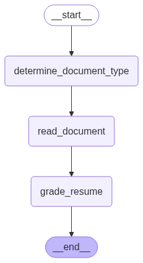

# Resume Reviewer

An AI-powered resume review system that automatically analyzes resumes (PDF or DOCX) and provides grades and feedback.



## Features

- **Document Type Detection**: Automatically detects whether the input file is PDF or DOCX
- **Information Extraction**: Extracts key information from resumes including:
  - Personal Information (Name, City)
  - Work Experience
  - Education
  - Skills
  - Certifications
- **AI Grading**: Provides a grade (1-10) and detailed feedback on the resume
- **Visual Workflow**: Generates a visual representation of the review process
- **Output Files**:
  - `workflow_diagram.png`: Visual representation of the review process
  - `AI_Review_example.txt`: Detailed review results

## Requirements

- Python 3.11+
- Google Gemini API Key (set in .env file)
- Required packages (see pyproject.toml)

## Setup

1. Clone the repository
2. Create a `.env` file with your Google API key:
   ```
   GOOGLE_API_KEY=your_api_key_here
   ```
3. Install dependencies:
   ```
   uv pip install -r requirements.txt
   ```

## Usage

1. Place your resume (PDF or DOCX) in the project directory
2. Update the `file_path` in `main.py` to match your resume file name
3. Run the script:
   ```
   python main.py
   ```

## Output

The script generates two files:
- `workflow_diagram.png`: A visual representation of the review workflow
- `AI_Review_example.txt`: Contains the resume grade and detailed feedback

## Architecture

The system uses a directed graph workflow with the following nodes:
1. Document Type Detection
2. Resume Content Extraction
3. Resume Grading

Each node uses the Google Gemini model for intelligent processing and analysis.

## Technologies Used

- LangChain
- Google Gemini AI
- PyPDF2
- python-docx
- LangGraph
- Pydantic